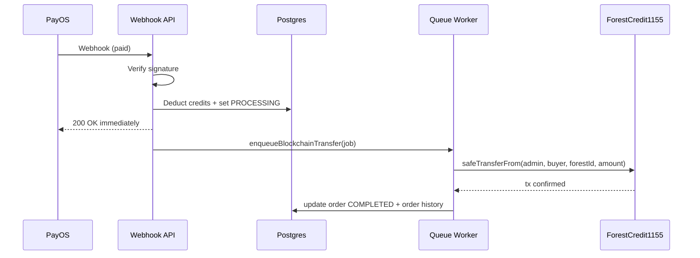

# Carbon Credit App: Blockchain Function Presentation

## Slide 1 - Title

**Implementing Blockchain Functions in Carbon Credit App**  
ERC-1155 tokenization + async on-chain settlement + Merkle audit anchoring

Presenter: [Your Name]  
Project: Carbon Credit App (Next.js + Prisma + Solidity)

Speaker notes:

- This presentation explains what blockchain functions were implemented, why this architecture was chosen, and how reliability/security were handled.
- Scope includes minting, transfer after payment, retirement, and audit proof anchoring.

---

## Slide 2 - Problem and Goals

### Business problem

- Need trustworthy ownership of carbon credits.
- Need fast user checkout (payment callback should not block).
- Need auditable evidence that order records were not tampered with.

### Engineering goals

- Represent many forest projects on-chain efficiently.
- Keep payment webhook responsive and idempotent.
- Provide verifiable audit trail using Merkle roots on-chain.

Speaker notes:

- We wanted both user experience and integrity: real-time app interactions, with blockchain-backed evidence.

---

## Slide 3 - High-Level Architecture

### Core layers

- Web/API: Next.js route handlers.
- Data: PostgreSQL via Prisma.
- Blockchain service: ethers.js wrappers + queue worker.
- Smart contracts: `ForestCredit1155` and `AuditAnchor`.

```mermaid
flowchart LR
  A[User Checkout] --> B[PayOS Payment]
  B --> C[/api/webhook]
  C --> D[(Postgres - Order/Inventory)]
  C --> E[Blockchain Queue]
  E --> F[ForestCredit1155 on Base]
  D --> G[Certificate + Notifications]
  H[ImmuDB audit hashes] --> I[Merkle Tree Builder]
  I --> J[AuditAnchor Contract]
```

Speaker notes:

- Payment processing and blockchain operations are decoupled.
- Audit anchoring is separate from token transfer, but both are blockchain functions in this project.

---

## Slide 4 - Smart Contract 1: ForestCredit1155

### Why ERC-1155

- One contract handles multiple forest tokens.
- Lower operational overhead than deploying many ERC-20 contracts.

### Implemented functions

- `mintForestCredits(to, forestId, amount, data)`
- `mintBatchForestCredits(to, forestIds, amounts, data)`
- `safeTransferFrom(...)` (standard ERC-1155 transfer)
- `retireForestCredits(from, forestId, amount)`
- URI management (`setBaseUri`, `setForestUri`)

### Role model

- `MINTER_ROLE` for minting.
- `URI_MANAGER_ROLE` for metadata URI updates.

Code references:

- [contracts/ForestCredit1155.sol](contracts/ForestCredit1155.sol)
- [src/services/blockchainService.ts](src/services/blockchainService.ts)

Speaker notes:

- `forestId` is directly mapped to token ID, simplifying domain mapping from app to chain.

---

## Slide 5 - Smart Contract 2: AuditAnchor

### Purpose

- Store Merkle roots of audit batches on-chain.
- Provide immutable timestamped proof of audit state.

### Implemented functions

- `anchor(bytes32 merkleRoot, uint256 auditCount)` (owner-only)
- `getAnchorCount()`
- `getAnchor(index)`
- `getLatestAnchor()`

Code references:

- [contracts/AuditAnchor.sol](contracts/AuditAnchor.sol)
- [src/lib/blockchain-service.ts](src/lib/blockchain-service.ts)
- [src/app/api/anchor/route.ts](src/app/api/anchor/route.ts)

Speaker notes:

- This enables trust-minimized verification that a specific order audit hash was part of an anchored batch.

---

## Slide 6 - End-to-End Payment to On-Chain Transfer

### Runtime flow

1. PayOS sends webhook to `/api/webhook`.
2. Signature is verified.
3. DB transaction decrements inventory and sets order to `PROCESSING`.
4. Blockchain transfer job is enqueued (fire-and-forget).
5. Queue worker calls `transferCreditsToBuyer(...)` for each forest token.
6. Order is marked `COMPLETED`; history logs tx hash.



Code references:

- [src/app/api/webhook/route.ts](src/app/api/webhook/route.ts)
- [src/lib/blockchain-queue.ts](src/lib/blockchain-queue.ts)

Speaker notes:

- This design prioritizes fast webhook acknowledgement while still performing on-chain settlement.

---

## Slide 7 - Data Model and Traceability

### On-chain linkage stored in DB

- Forest stores `contractAddress`, `onChainTokenId`, `mintTxHash`, `mintBlockNumber`, `mintChainId`.
- Order stores `transactionHash`.
- `BlockchainAnchor` stores merkle root, tx hash, block number, audit count, and related order IDs.

Code reference:

- [prisma/schema.prisma](prisma/schema.prisma)

Speaker notes:

- This creates an auditable bridge between business records and blockchain evidence.

---

## Slide 8 - Reliability and Security Controls

### Controls implemented

- Webhook signature verification before processing.
- Webhook idempotency via unique event signature.
- Inventory guard (`availableCredits >= requested`) in transaction.
- Contract role checks and readable AccessControl error decoding.
- Buyer wallet validation with `ethers.isAddress`.
- Config validation for RPC endpoint and required env vars.

Code references:

- [src/app/api/webhook/route.ts](src/app/api/webhook/route.ts)
- [src/lib/payment-service.ts](src/lib/payment-service.ts)
- [src/lib/credit-inventory.ts](src/lib/credit-inventory.ts)
- [src/services/blockchainService.ts](src/services/blockchainService.ts)
- [scripts/deploy-contract.ts](scripts/deploy-contract.ts)

Speaker notes:

- Reliability controls reduce duplicate processing and overselling.
- Security controls protect role-based minting and malformed config issues.

---

## Slide 9 - Deployment and Operations

### Contract pipeline

- Compile: `npm run contract:compile`
- Deploy forest token: `npm run contract:deploy:forest`
- Deploy audit anchor: `npm run contract:deploy:audit`
- Grant minter role: `npm run contract:grant:minter`

### Required env vars (core)

- `BASE_RPC_URL`
- `BASE_CHAIN_ID`
- `FOREST_1155_CONTRACT_ADDRESS`
- `ANCHOR_CONTRACT_ADDRESS`
- `ADMIN_WALLET_PRIVATE_KEY`
- `ANCHOR_PRIVATE_KEY`

Code references:

- [scripts/compile-contract.js](scripts/compile-contract.js)
- [scripts/deploy-contract.ts](scripts/deploy-contract.ts)
- [scripts/grant-forest-minter-role.ts](scripts/grant-forest-minter-role.ts)

Speaker notes:

- Operations are scriptable and repeatable for testnet/mainnet transitions.

---

## Slide 10 - Risks, Limitations, and Improvements

### Current limitations

- Queue is in-memory EventEmitter: jobs may be lost on process restart.
- Partial transfer failures still set order to `COMPLETED` with history logs.

### Recommended next improvements

- Move queue to durable worker (BullMQ + Redis).
- Add retry policy + dead-letter queue for failed transfers.
- Add reconciliation task: compare DB expected balances vs chain events.
- Use multisig/secure key management for admin wallets.

Speaker notes:

- This slide demonstrates engineering maturity: not just what works now, but clear path to production hardening.

---

## Slide 11 - Demo Script (2-3 minutes)

1. Create/approve a forest with initial mint.
2. Show minted linkage fields in DB/API response.
3. Place an order and trigger payment webhook.
4. Show order transitions (`PENDING -> PROCESSING -> COMPLETED`).
5. Show blockchain tx hash in order history.
6. Trigger `/api/anchor` action and show Merkle root + tx.

Speaker notes:

- Keep demo focused on proof points: mint, transfer, and anchor.

---

## Slide 12 - Conclusion

### What was achieved

- Multi-forest carbon credit tokenization with ERC-1155.
- Asynchronous blockchain settlement integrated with payment webhook.
- On-chain audit anchoring for verifiable integrity.

### Project impact

- Better trust for buyers and auditors.
- Scalable architecture for additional forests and transactions.
- Strong foundation for production-grade carbon credit transparency.

---

## Appendix - Quick Q&A Answers

### Why ERC-1155 instead of ERC-20?

- One contract supports many token IDs (forests), reducing deployment and maintenance complexity.

### How is double-processing prevented?

- Webhook idempotency plus transactional order-state checks.

### How can an auditor verify an order?

- Recompute leaf hash, verify Merkle proof against anchored root, check on-chain anchor tx.

### What network is used?

- Configured via env (`BASE_CHAIN_ID`) and RPC endpoint (`BASE_RPC_URL`).
